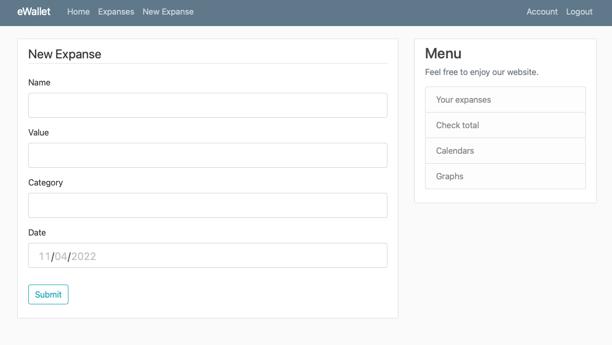
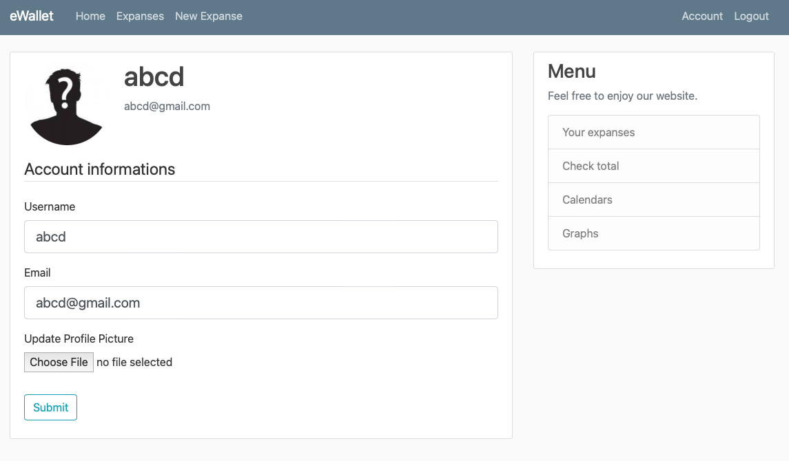
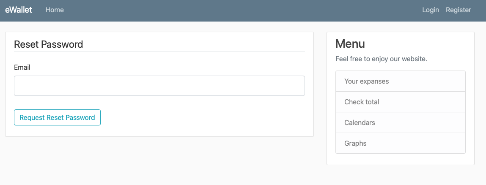

# eWallet Project
## Web application using `Python Flask`.

**eWallet** allows us to manage our expanses. We can add new expanse, manage already existing and do some queries. It suports many accounts with authentication.  

  

User get's an welcome email after registration and can reset his password using his email address.

  

`Templates` and `Forms` are separated into Blueprints and code is a `Python Package`

